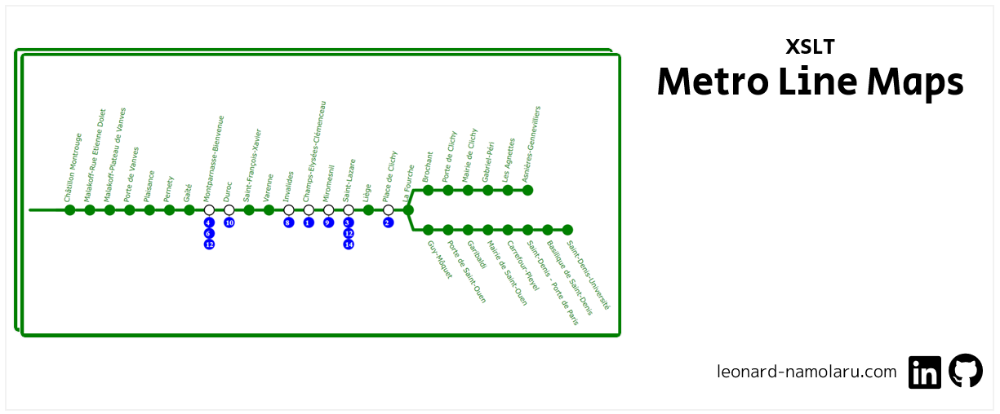

### [Français] Cartes des lignes du métro
> :school: **Lieu de formation :** Université Paris Cité, Campus Grands Moulins (ex-Paris Diderot)
> 
> :books: **UE :** Format de documents et XML 
> 
> :pushpin: **Année scolaire :** M1
> 
> :calendar: **Dates :** avr. 2022 - mai 2022 
> 
> :chart_with_upwards_trend: **Note :** 16/20

Le but de ce projet est de convertir par un programme en Python, au format XML, un ensemble de données brutes (fichier CSV) décrivant la structure du métro parisien, puis d’extraire de ces données converties, à l’aide de XSLT, des cartes des différentes lignes du métro en SVG – sur le modèle des cartes horizontales affichées dans les rames.

#### Principales fonctionnalités
- Un script Python scanne le fichier csv et crée un fichier XML avec une représentation du réseau du métro parisien. Dans le fichier csv il y a beaucoup d’informations qui se répètent (l’adresse de chaque gare, les trajets des lignes qui n’ont pas de différence dans leur parcours aller/retour apparaissent deux fois (une fois pour chaque sens, etc.) et donc le minimum d’informations possible est conservé dans le fichier XML.
- Un Schéma XML a été préparé pour vérifier que le fichier XML généré est correct. Un fichier DTD a également été préparé mais naturellement les capacités de test de ce fichier sont plus limitées.
- On détermine pour le fichier XSLT la carte de quelle ligne on veut afficher, puis le code XSLT convertit le fichier XML en une carte graphique de la ligne demandée, en SVG.
- Le fichier XSLT sait reconnaître quand les sens aller et retour ne sont pas les mêmes et agit en conséquence afin d’afficher une carte adaptée (ligne 10 par exemple).
- Le code XSLT sait afficher une carte correcte même lorsqu’il s’agit de lignes dont le parcours est divisé en deux destinations différentes (lignes 13 et 7)
- Pour chaque station, la liste des autres lignes de métro qui s’y arrêtent est affichée.

#### Exécution
Commandes qui doivent être exécutées dans l'invite de commande afin d'utiliser les fichiers du projet :

-  **Script python:** *extracteur.py* (l'exécution du programme prend du temps)
````
PS C:\Users\lenny\git\projet-xml> python extracteur.py base_ratp.csv
````

-  **DTD:** *metro.dtd*

Le fichier xsd (Schéma XML) est conçu pour vérifier que la structure du fichier xml est correcte et conforme au format spécifié. Nous avons créé également un fichier DTD ayant le même objectif. Cependant, l'utilisation du fichier xsd est bien sûr à privilégier car il permet un meilleur contrôle du contenu du fichier xml.

A ajouter au document xml (apres la 1er ligne) : `<!DOCTYPE ratp SYSTEM "metro.dtd">`
```
xmllint -dtdvalid metro.dtd fichier_xml.xml
```

- **Schéma XML:** *metro.xsd*
```
xmllint --schema metro.xsd fichier_xml.xml
```
Le Fichier est valide si cette commande affiche : `fichier_xml.xml validates`.

- **XSLT:** *stylesheet.xsl* 

La modification du numéro de la ligne de métro se fait en modifiant la valeur de la variable suivante dans le fichier :
```
	<!-- Une variable qui a pour but de stocker le numéro de ligne dont on veut afficher le plan -->
	<xsl:variable name="numero-ligne" as="xsd:string">
		<xsl:value-of select="14" />
	</xsl:variable>
```	

Un exemple de changement:
```	
	<!-- Une variable qui a pour but de stocker le numéro de ligne dont on veut afficher le plan -->
	<xsl:variable name="numero-ligne" as="xsd:string">
		<xsl:value-of select="'7B'" />
	</xsl:variable>
```
	
La commande: 
```	
java -jar saxon-he-10.3.jar -s:fichier_xml.xml -xsl:stylesheet.xsl -o:out.svg
```	
